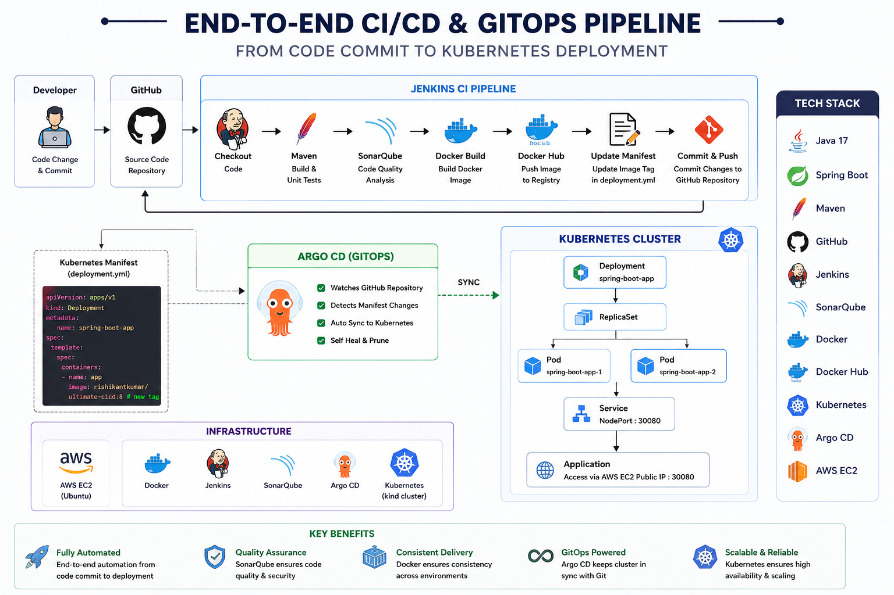
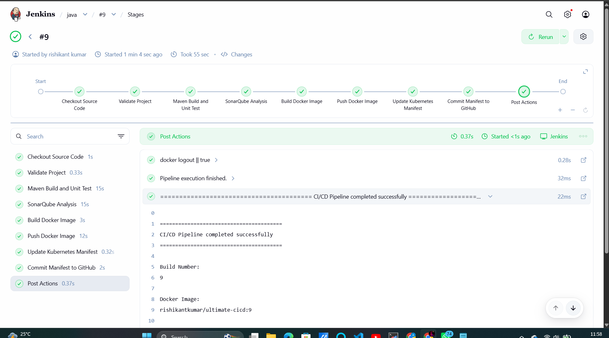
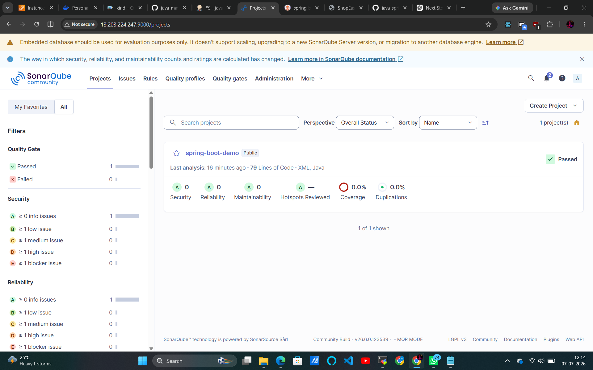
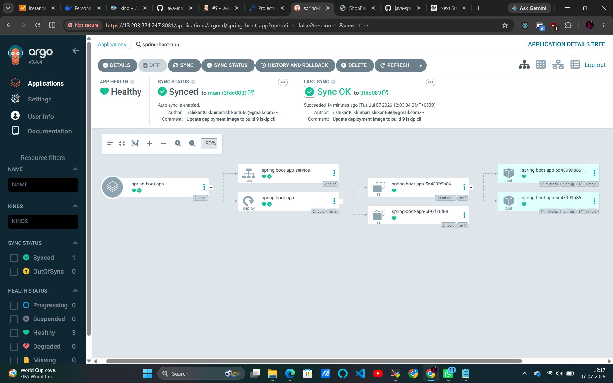
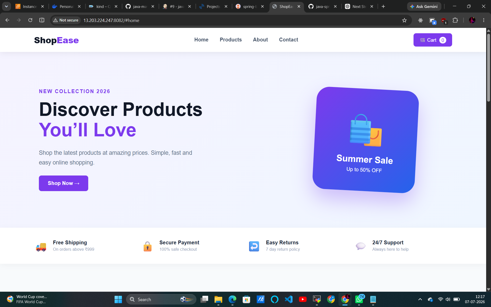

# 🚀 End-to-End CI/CD & GitOps Pipeline for Spring Boot Application

<p align="center">


</p>

---

# 📌 Project Overview

This project demonstrates a complete **Enterprise CI/CD & GitOps workflow** for deploying a Java Spring Boot application.

Instead of deploying manually, the entire software delivery process is fully automated.

### The pipeline performs

- Source Code Checkout
- Maven Build
- Unit Testing
- SonarQube Code Analysis
- Docker Image Build
- Push Image to Docker Hub
- Update Kubernetes Manifest
- Push Manifest to GitHub
- Argo CD Auto Sync
- Deploy to Kubernetes Cluster

---

# 🔄 Complete Workflow

```
Developer
    │
    ▼
GitHub Repository
    │
    ▼
Jenkins Pipeline
    │
    ├── Maven Build
    ├── Unit Testing
    ├── SonarQube Scan
    ├── Docker Build
    ├── Push Docker Image
    ├── Update deployment.yml
    └── Push Manifest to GitHub
                     │
                     ▼
               Argo CD (GitOps)
                     │
                     ▼
             Kubernetes Cluster
                     │
                     ▼
             Spring Boot Application
```

---

# 🏗 Architecture

<p align="center">

</p>

---

# ⚙ Jenkins Pipeline

<p align="center">

</p>

### Pipeline Stages

- Checkout Source Code
- Validate Project
- Maven Build
- Unit Testing
- SonarQube Analysis
- Docker Image Build
- Docker Push
- Update Kubernetes Manifest
- Commit Manifest
- GitOps Deployment

---

# 🔍 SonarQube Analysis

<p align="center">

</p>

### Quality Checks

- Code Smells
- Bugs
- Vulnerabilities
- Maintainability
- Quality Gate

---

# 🚀 Argo CD Deployment

<p align="center">

</p>

### GitOps Features

- Auto Sync
- Self Heal
- Prune
- Continuous Deployment
- Desired State Reconciliation

---

# 🌐 Application

<p align="center">

</p>

The Spring Boot application is deployed on Kubernetes and exposed through a Kubernetes Service.

---

# 🛠 Tech Stack

| Category | Technology |
|-----------|------------|
| Language | Java 17 |
| Framework | Spring Boot |
| Build Tool | Maven |
| Version Control | Git & GitHub |
| CI | Jenkins |
| Code Analysis | SonarQube |
| Containerization | Docker |
| Registry | Docker Hub |
| Orchestration | Kubernetes (Kind) |
| GitOps | Argo CD |
| Cloud | AWS EC2 |

---

# 📂 Project Structure

```
java-maven-sonar-argocd-helm-k8s
│
├── spring-boot-app/
│
├── spring-boot-app-manifests/
│
├── Argo CD/
│
├── README.md
│
├── Architecture.png.png
├── application.png.png
├── argocd.png.png
├── jenkins.png.png
└── sonarqube.png.png
```

---

# 🚀 How to Run

### Clone Repository

```bash
git clone https://github.com/rishikant0/java-maven-sonar-argocd-helm-k8s.git
```

### Build Application

```bash
mvn clean package
```

### Build Docker Image

```bash
docker build -t your-image .
```

### Deploy

```bash
kubectl apply -f spring-boot-app-manifests/
```

---

# ✨ Features

- End-to-End CI/CD
- GitOps Deployment
- Kubernetes Orchestration
- Dockerized Application
- Automatic Image Versioning
- SonarQube Quality Analysis
- Auto Deployment with Argo CD
- AWS EC2 Deployment

---

# 👨‍💻 Author

**Rishikant Kumar**

GitHub: https://github.com/rishikant0

LinkedIn: *(Add your profile here)*

---
